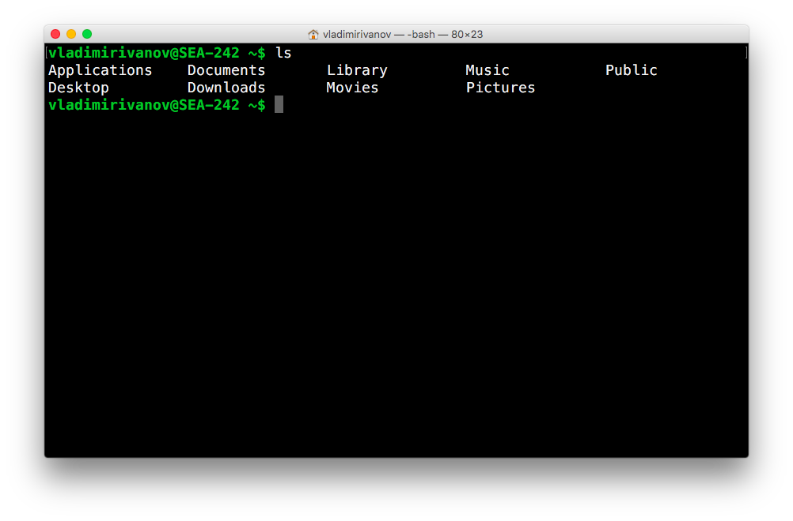

# Command Line Wizardry

## Введение

Операционная система Unix появилась давно, в семидесятых годах XX века. По
правде говоря, эта система была написана программистами для программистов, что
определило некоторые её особенности. В семидесятых концепция графического
интерфейса для компьютера (то, что называется [WIMP]) только появлялась, так что
не удивительно, что основным способом взаимодествия человека и машины был
текстовый интерфейс ([телетайп] был широко распространен).

## Терминал и оболочка

Для того, чтобы взаимодействовать с человеком, среди всех программ, входивших в
Unix существовала специальная, предназначенная для получения команд и запуска
других программ. Она называлась *shell* или, по-русски, *оболочка*. В настоящее
время существует несколько вариантов оболочки, отличающихся функциональностью.
Самой распространенной (и используемой по умолчанию в большинстве случаев)
является оболочка **bash**.

Когда пользователь запускает **Terminal** (эта программа расположена в каталоге
/Applications/Utilities), можно сказать, что эта программа ответственна только
за рисование окна. А внутри терминала запускается оболочка, которая и принимает
команды пользователя.

[WIMP]: https://en.wikipedia.org/wiki/WIMP_(computing)
[телетайп]: https://ru.wikipedia.org/wiki/Телетайп
