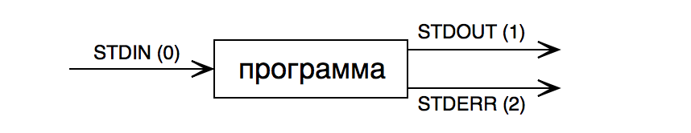

# Command Line Wizardry

## Введение

Операционная система Unix появилась давно, в семидесятых годах XX века. По
правде говоря, эта система была написана программистами для программистов, что
определило некоторые её особенности. В семидесятых концепция графического
интерфейса для компьютера (то, что называется [WIMP]) только появлялась, так что
не удивительно, что основным способом взаимодествия человека и машины был
текстовый интерфейс ([телетайп] был широко распространен).

## Терминал и оболочка

Для того, чтобы взаимодействовать с человеком, среди всех программ, входивших в
Unix существовала специальная, предназначенная для получения команд и запуска
других программ. Она называлась *shell* или, по-русски, *оболочка*. В настоящее
время существует несколько вариантов оболочки, отличающихся функциональностью.
Самой распространенной (и используемой по умолчанию в большинстве случаев)
является оболочка **bash**.

Когда пользователь запускает **Terminal** (эта программа расположена в каталоге
/Applications/Utilities), можно сказать, что эта программа ответственна только
за рисование окна. А внутри терминала запускается оболочка, которая и принимает
команды пользователя.

Оболочка принимает команду от пользователя, выполняет её и печатает результат.
На картинке выше текст, напечатанный зеленым цветом - _приглашение_ **bash**.
Текст "**ls**" - команда, введенная пользователем, а остальной текст - результат
выполнения команды **ls**.

На самом деле, у оболочки есть относительно немного команд. Когда я писал этот
текст, я насчитал у **bash** 107 _встроенных_ команд. Но оболочка устроена так,
что если введенная команда не является встроенной, то оболочка ищет в
специальном каталоге (или специальных каталогах) программу с таким же именем.
Если такая программа найдется, оболочка запускает её, как будто бы это была
встроенная команда.

Например, в качестве упражнения, можно сравнить результат выполнения встроенной
команды **history** с результатом запуска уже упоминавшейся программы **ls**. По
результату непросто догадаться, где – встроенная команда, а где — программа. И
это хорошо. Больше мы на этом задерживаться не будем. Слова "программа" и
"команда" будем считать взаимозаменяемыми.

## Запуск простых команд

Вот несколько простых команд Unix:

* **ls** - команда, показывающая содержимое каталога. Если **ls** запустить с _опцией_ "**-l**" (маленькая латинская "эл"), то помимо имен файлов будут показаны их размер, дата последнего изменения и кое-что еще, на что прямо сейчас можно не обращать внимания.
* команда **cd** (это, кстати, _встроенная_ команда) позволяет изменить текущий каталог. Для этого нужно передать имя каталога в качестве параметра. Например, если в текущем каталоге есть подкаталог Documents, можно перейти в него командой "**cd Documents**".
* помощью команды **cat** можно посмотреть содержимое файла. Если команде **cat** в качестве параметров указать несколько файлов, она покажет их все подряд.
* команды **head** и **tail** похожи. Первая показывает начало, а вторая — конец файла, указанного в качестве параметра. По умолчанию будет показано 10 строк, но можно передать число строк в виде _опции_, например **tail -5 file.txt** покажет 5 последних строк файла file.txt.
* команда **say** специфична для Mac OS X. Она читает текст, переданный в качестве параметров. Например, попробуй запустить **say "hello there"**.

Стоит попробовать их позапускать и посмотреть на результат.

## Стандартные потоки ввода и вывода

Концепция потоков ввода и вывода возникла ещё до появления Unix.

Идея проста — у программы есть (почти) всегда есть три потока, три трубы, с
помощью которых она общается с внешним миром. В Unix эти потоки пронумерованы:

- Стандартный поток ввода, так называемый STDIN, номер 0
- Стандартный поток вывода, так называемый STDOUT, номер 1
- Стандартный поток ошибок, так называемый STDERR, номер 2

По умолчанию программа получает данные из стандартного потока ввода, выводит
результат на стандартный поток вывода, а сообщения об ошибках отправляет на
стандартный поток ошибок. Если не делать никаких изменений, то стандартный поток
запущенной программы связан с тем, что пользователь вводит с клавиатуры, а
стандартный вывод и вывод ошибок — с печатью на экране, в окне **Terminal**.

То есть, **ls** из раздела выше не просто печатает список файлов на экран, на
самом деле, она выводит этот список на стандартный вывод, а тот уже оказывается
экраном (если не вдаваться в детали, программа может и не знать, куда на самом
деле указывают стандартные потоки).

Но что может быть стандартным потоком, помимо экрана и клавиатуры? Крутость Unix
(или оболочки, не разберешь) в том, что стандартные потоки можно перенаправлять.

Для перенаправления в оболочке существует три директивы:

- ">"
- "<"
- "|", читается, как _пайп_ (потому, что _pipe_)

Директива ">" перенаправляет стандартный вывод предыдущей команды в файл.
Например, если запустить "**ls -l > list.txt**", то на экране ничего не
возникнет. Вместо этого, в текущем каталоге появится (а если он там был - то
будет перезаписан) файл list.txt со списком файлов. В данном случае, **ls**
выводила результат на стандарный вывод, а оболочка позаботилась о том, чтобы
стандартный вывод был связан с файлом, а не с экраном.

Директива "<" перенаправляет файл в стандартный ввод предыдущей команды.
**TODO**: тут у меня нет хорошего примера.

Наконец, директива "|" — самая удивительная. Она соединяет стандартный вывод
команды, указанной до неё со стандартным вводом команды, указанной после.

Тут небольшое лирическое отступление: многие команды Unix устроены так, что при
отсутствии имени файла в параметрах, стараются получить данные из стандартного
ввода. Например, так себя ведут **head** и **tail**. Поэтому **ls -l | head -3**
покажет первых три строчки, напечатанные командой **ls**. Происходит это потому,
что **ls -l** печатает список файлов на стандартный вывод, директива "|"
перенаправляет стандартный вывод **ls** на стандартный ввод **head**, а **head**
с опцией **-3** и без имени файла в качестве параметра печатает первых 3 строки
своего стандартного ввода.

Поэтому "|" и называется "_трубой_" - она как бы связывает один вывод с другим
вводом.

Совокупность команд, объединенных уже упомянутыми (и еще не упомянутыми)
директивами, назвыается _конвейер_. Интересно, что в принципе конвейер может
быть произвольной длины. Например, "**ls | tail -3 | say**" прочитает имена
трех последних файлов в текущем каталоге. Это работает потому, что если
**say** не передать никаких параметров, она будет читать текст, переданный на
стандартный ввод.

## Самая полезная команда

Самая полезная команда — **man** (от слова manual).

**man** с параметром покажет страницу руководства по соответствующей команде,
файлу или программному компоненту операционной системы. Например, стоит почитать
**man man**, **man ls**, **man head** и **man tail** (кстати, размер руководства
по **tail** заметно больше размера руководства по **head**). Можно даже почитать
**man bash**, но это руководство довольно большое и скучное местами.

Для того, чтобы выйти из программы **man** нужно нажимать кнопку "q".

## Несколько команд посложнее и рабочий пример конвейера

Теперь, когда мы немного разобрались с перенаправлением ввода и вывода,
посмотрим еще на несколько примеров. Но для начала, вот еще полезные команды
(кстати, про каждую из них можно почитать **man**):

- команда **ps** показывает список запущенных программ. У нее обширное
  руководство, куча опций, на которых я не буду останавливаться. Для нашего
  следующего упражнения её нужно будет запускать так: **ps -Aco
  pid,pcpu,rss,comm**. Это означает "покажи мне список всех запущенных программ
  и для каждой укажи её уникальный номер, какую долю процессора она занимает,
  сколько памяти она занимает и, наконец, имя исполняемого файла". Можно
  запустить и посмотреть на результат.

- команда **sort** делает именно это - сортирует подаваемые данные. Если ей в
  качестве параметра передать имя файла, она выведет на стандартный вывод его
  в отсортированном виде (при этом, сам файл не изменится). Если не передавать
  никаких параметров, **sort** будет ожидать данные на стандартном потоке
  ввода. У **sort** много опций (загляни в **man**), прямо сейчас нам
  понадобится всего пара. Одна - "-k". Эта опция позволяет указать, по какой колонке
  нужно сортировать полученные данные. Например, **sort -k5** отсортирует
  данные по пятой колонке. Дополнительно можно указать, что в этой колонке
  находится число (по умолчанию, **sort** сортирует данные, как строки, в
  алфавитном порядке). Для этого, после номера колонки нужно указать
  модификатор "n", вот так: **sort -k5n**. Вторая полезная опция - "-r". Она
  указывает, что сортировку нужно выполнить в обратном порядке.

ps, sort, grep, cut, nroff, less, uniq

ps -Aco pid,pcpu,rss,comm | sort
nroff | tbl | less

[WIMP]: https://en.wikipedia.org/wiki/WIMP_(computing)
[телетайп]: https://ru.wikipedia.org/wiki/Телетайп
